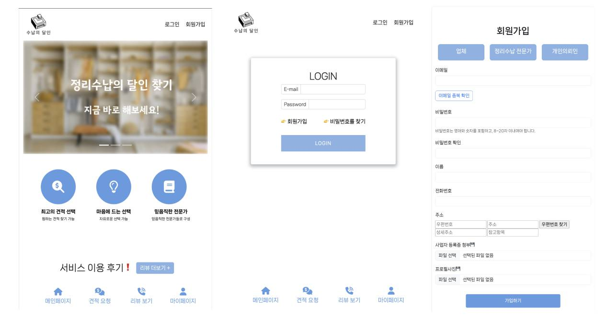
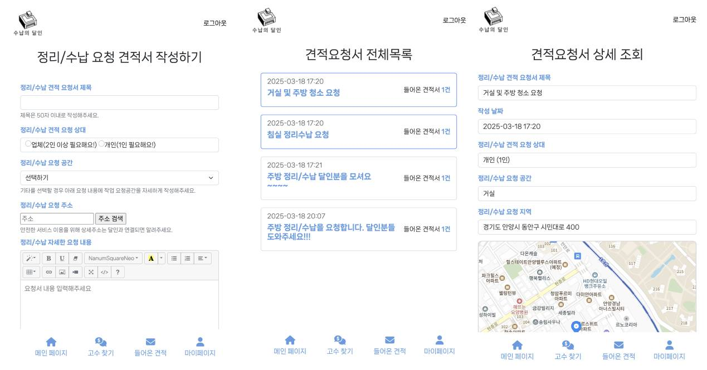
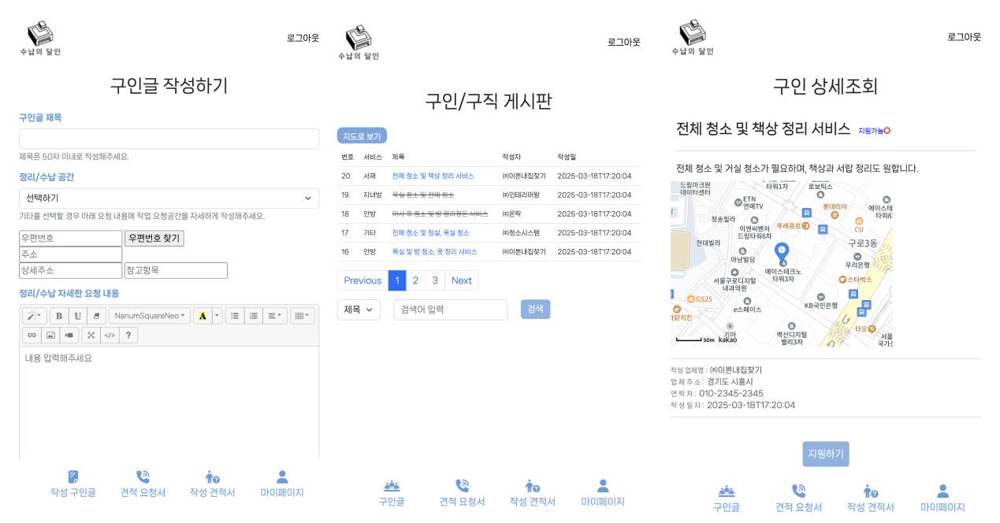
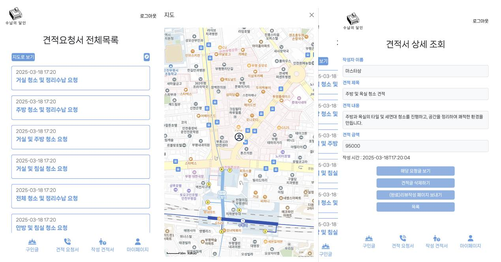
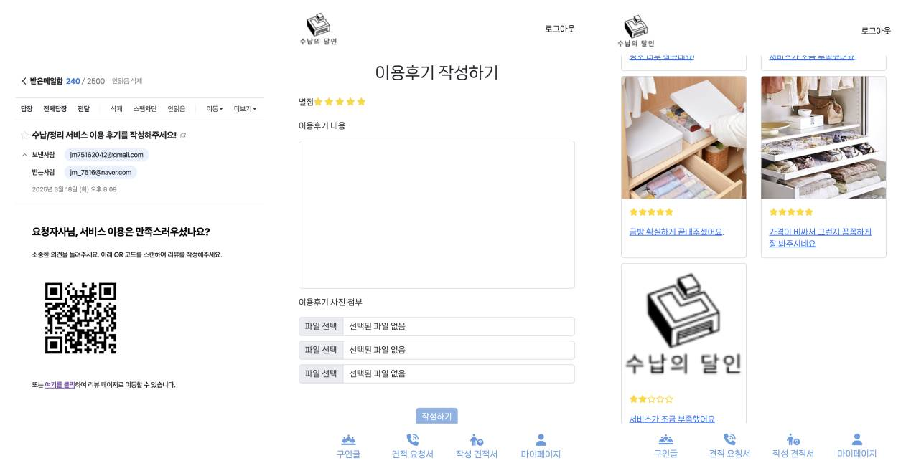

# webProject_team1

## 프로젝트 기간

---

2025년 2월 18일 (화) ~ 2025년 3월 17일 (월)

## 팀 구성

---

유지명, 선근호, 김진홍, 임준수

## 개요

---

정리수납 서비스 이용자와 인증된 정리수납 전문가(개인/업체)를 안전하게 연결해주는 플랫폼

이용자는 검증된 전문가를 통해 신뢰할 수 있는 정리수납 서비스를 제공 받을 수 있으며, 정리수납 전문가(정리수납가 및 업체)는 플랫폼을 통해 구직 및 구인 기회 확보 가능

---

## ER-D
(./readMe/ERD.jpg)

---

## 주요 기능

### 유지명

- 견적 요청서 작성 기능
- 견적 요청서 (전체 , 업체/마스터별) 조회 기능
- 견적 요청서 상세 출력 기능
- 견적서에 들어온 요청서 채택 기능
- 채택된 견적서에 리뷰 요청 기능 → 이메일로 QR코드 생성하여 URL을 발송
- 리뷰 작성 기능
- 리뷰 조회 기능
- 리뷰 수정 기능
- 리뷰 삭제 기능

### 김진홍

- 로그인한 회원이  master일 때
    - 구인글 게시판
        - 구인글 전체 리스트 출력 기능
        - 제목/내용 : key, 검색어 : keyword로 설정하여 검색 기능
        - 게시판 페이지 조회 기능 (검색기능 유지)
    - 구인글 상세조회
        - 해당 구인글 상세 출력 기능
        - 지도 api로 설정된 주소의 위도,경도로 지도 마커 기능
        - 해당 구인글 지원하기 버튼으로 지원 및 지원취소 가능
    - 지도로 구인글 조회
        - 전체 구인글 및 구인글에 설정된 서비스 종류로 설정하여 검색 기능
            
            → 지도 api를 통하여 검색 시 구인마감 되지 않은 구인글 지도에 마커 및 글 제목 표시 기능
            
- 로그인한 회원이 company일 때
    - 작성한 구인글  페이지
        - 로그인한 회원의 작성 구인글 전체 리스트 출력 기능
        - 제목/내용 : key, 검색어 : keyword로 설정하여 검색 기능
        - 게시판 페이지 조회 기능 (검색기능 유지)
        - 구인글 작성 기능
        - api 활용하여 설정한 주소 설정 및 주소에 맞는 위도 경도 저장 기능
    - 구인글 상세 조회
        - 해당 구인글 상세 출력 기능
        - 지도 api로 설정된 주소의 위도,경도로 지도 마커 기능
        - 구인글 마감상태 변경 기능
        - 구인글 수정 기능
        - 구인글 삭제 기능

### 선근호

- 회원 가입( company / master / requester )
    - 회원 가입 시 role-box company 클릭 시 업체 관련 사진 첨부 생성
    - 회원 가입 시 role-box master 클릭 시  수료증, 범죄 사실 증명 서류 사진 첨부 생성
    - 회원 가입 시 role-box requester 클릭 시  프로필 사진 첨부 생성
    - 이메일 중복 검사, 비밀번호 유효성 검사
- 로그인
- 로그아웃
- 회원 탈퇴
- 회원 정보 수정
- 주소 입력 대신 주소API
- 사업자 번호 진위 여부 API

### 임준수

- 견적서 작성 기능
- 견적서 (전체, 상세)조회 기능
- 견적서 삭제 기능
- 요청서/구인글 조회시 내위치 기반으로 가까운 글 조회 기능
- 마이페이지 조회 기능

---

## 페이지 구현
### 메인 화면, 로그인 화면, 회원가입 화면

### 요청서 작성 화면, 목록 화면, 조회 화면

### 구인글 작성 화면, 목록 화면, 조회 화면

### 견적서 조회 화면, 지도로 조회 화면, 상세조회 화면

### 리뷰 URL 이메일 전송 화면, 작성 화면, 조회 화면

[JAVA_WEB_Project 1조 영상 0217](https://youtu.be/ZwstbcVF0nk)