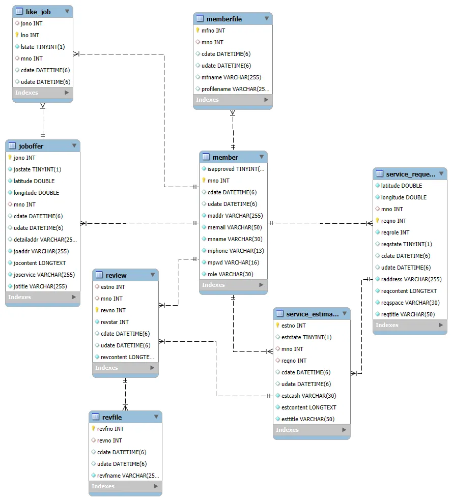

# 정리수납 중개 플랫폼 - Team 1

## 📅 프로젝트 기간
2025년 2월 18일 (화) ~ 2025년 3월 17일 (월)

## 👨‍👩‍👧‍👦 팀 구성
- 유지명
- 선근호
- 김진홍
- 임준수

---

## 📝 프로젝트 개요

정리수납 서비스 수요자(이용자)와 검증된 정리수납 전문가(개인/업체)를 안전하고 신뢰성 있게 연결해주는 중개 플랫폼입니다.

- **이용자**는 검증된 전문가를 통해 신뢰할 수 있는 정리수납 서비스를 받을 수 있고,  
- **전문가(개인 및 업체)**는 플랫폼을 통해 다양한 구직 및 구인 기회를 얻을 수 있습니다.

---

## 🧱 기술 스택

| 구분 | 기술 |
|------|------|
| Frontend | HTML / CSS / JavaScript / Thymeleaf |
| Backend | Java (Spring Framework), JPA |
| Database | MySQL |
| API 활용 | Kakao Map API, Geolocation API, 도로명주소 API, 사업자등록 진위확인 API, Google SMTP, QR 코드 생성 |

---

## 🔗 ERD

---

## 🔧 주요 기능 및 담당자

### 유지명
- 견적 요청서 작성 및 조회 (전체, 업체/마스터별)
- 견적 요청서 상세 조회
- 견적서 채택 기능
- 리뷰 요청 (QR코드 포함 URL 이메일 발송)
- 리뷰 작성, 조회, 수정, 삭제

---

### 김진홍

#### 로그인 회원이 master일 경우
- 구인글 게시판 목록 / 검색 / 페이징 기능
- 구인글 상세 조회 (지도 API 활용 마커 표시)
- 구인글 지원 / 지원 취소 기능
- 서비스 종류별 구인글 지도 검색 기능

#### 로그인 회원이 company일 경우
- 작성한 구인글 목록 / 검색 / 페이징 기능
- 구인글 작성 / 수정 / 삭제
- 지도 API 기반 주소 마커 표시
- 구인글 마감 처리

---

### 선근호
- 회원가입 (company / master / requester 구분)
  - company: 업체 이미지 등록
  - master: 수료증 및 범죄 사실 증명 사진 첨부
  - requester: 프로필 사진 첨부
- 이메일 중복 검사, 비밀번호 유효성 검사
- 로그인 / 로그아웃
- 회원 정보 수정 / 탈퇴
- 주소 API 활용
- 사업자등록번호 진위 여부 확인

---

### 임준수
- 견적서 작성 / 조회 / 삭제
- 내 위치 기반 요청서 및 구인글 조회 (거리순)
- 지도 기반 요청서 조회 기능
- 견적 마감 처리 (채택/기한 만료)
- 마이페이지 기능

---

## 🖥 주요 화면

### 메인 / 로그인 / 회원가입 화면

### 요청서 작성 / 목록 / 조회 화면

### 견적서 목록 / 지도 조회 / 상세 화면

### 리뷰 URL 이메일 전송 / 작성 / 조회 화면

### 구인글 작성 / 목록 / 상세 화면

---

## 🎥 시연 영상
[JAVA_WEB_Project 영상 보기](https://www.youtube.com/watch?v=VtXWd4tA1A4)

---

